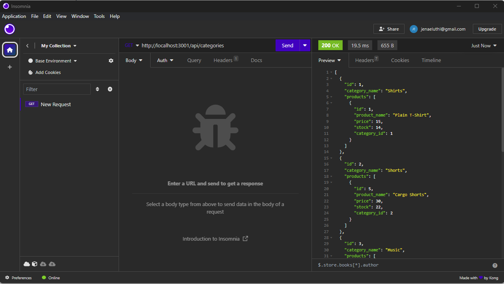

# E-commerce Back End Starter Code# Commerce 
   
 https://github.com/Jelu113/Commerce
 ## Table of Contents
-[Description](#description)  
-[Installation](#installation)  
-[Usage](#usage)  
-[Credits](#credits)  
-[License](#license)  
-[Badges](#badges)  
-[Features](#features)  
-[How to contribute](#contribute)  
-[Tests](#tests)  

 ## Description
 https://github.com/Jelu113/Commerce
 to show my knowledge of mysql and the routes on the back end.
 
 This project will help track merchandise. 
 I learned mysql2 and sequilize to accomplish this project. 
 
 I had to buy a new computer in order to finish this project as my last computer died on me, so I had to reinstall everything and get a new SSH key for this computer as well.
 

## Installation
You will need SQL and NODE.JS in order to run this code, and Insomnia or another backend run test program. 
## Usage

## Credits
I had help from a tutor and the starter code for this project.  I also used course materials to fill in some of the code.

